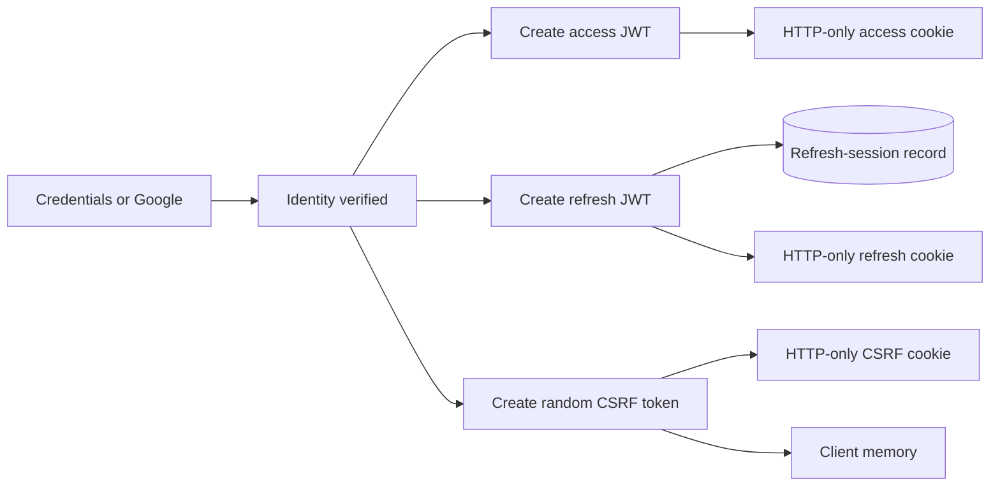
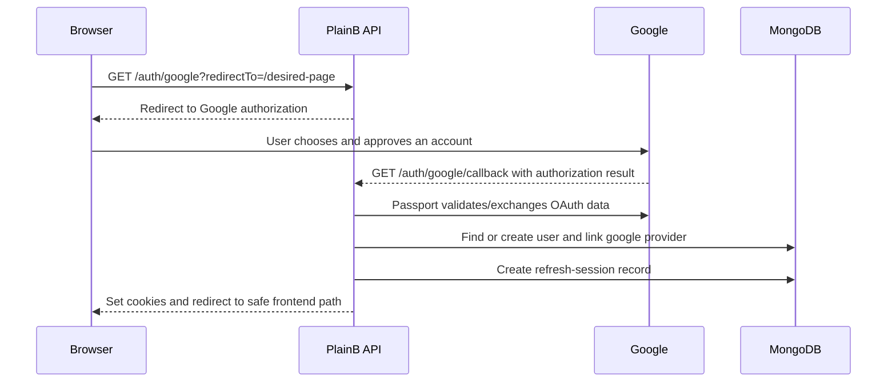
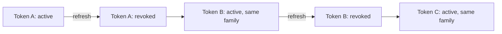

# PlainB Authentication Guide

This document explains how authentication works in PlainB, from account creation to logout. It is both a learning guide and a map to the current implementation.

## 1. The big picture

PlainB supports two ways to prove identity:

1. **Email and password**
2. **Google OAuth 2.0**

After either method succeeds, the server creates the same kind of application session:

- a short-lived **access token**;
- a longer-lived, rotating **refresh token**;
- a random **CSRF token**.

All three are delivered as cookies. The browser sends the authentication cookies automatically. The React client also keeps the CSRF token in memory and copies it into a request header for state-changing requests.



Authentication answers **“Who is this user?”** Authorization answers **“May this user perform this action?”** PlainB does both:

- JWT verification establishes an authenticated identity.
- The current database user state and role determine authorization.

## 2. Important files

### Server

- `server/src/app/modules/auth/auth.route.ts` — authentication endpoints.
- `server/src/app/modules/auth/auth.controller.ts` — HTTP request and response handling.
- `server/src/app/modules/auth/auth.service.ts` — session creation, refresh rotation, reuse detection, and revocation.
- `server/src/app/config/passport.config.ts` — password and Google identity verification.
- `server/src/app/middlewares/AuthMiddleware.ts` — protects endpoints and checks roles.
- `server/src/app/middlewares/csrfProtection.ts` — rejects unsafe requests without a matching CSRF token.
- `server/src/app/utility/generateAuthTokens.ts` — creates access and refresh JWTs.
- `server/src/app/utility/setCookies.ts` — configures authentication cookies.
- `server/src/app/modules/auth/refresh-session.model.ts` — database records for refresh sessions.
- `server/src/app/modules/user/user.service.ts` — registration, email verification, and password changes.
- `server/src/app/modules/user/user.model.ts` — user fields and password hashing.

### Client

- `client/src/features/auth/store/auth.store.ts` — Zustand authentication state and actions.
- `client/src/lib/api/client.ts` — Axios cookies, CSRF headers, and automatic refresh.
- `client/src/features/auth/components/AuthProvider.tsx` — restores the session when the app starts.
- `client/src/features/auth/components/AuthGuard.tsx` — redirects unauthenticated visitors away from protected pages.
- `client/src/pages/LoginPage.tsx` — credentials and Google login entry points.
- `client/src/pages/RegisterPage.tsx` — credentials registration.
- `client/src/pages/VerifyEmailPage.tsx` — OTP verification.

## 3. Core concepts

### Authentication

Authentication proves who a user is. A password or Google account is used only to establish identity. After that, PlainB uses its own tokens for API requests.

### Authorization

Authorization decides what an authenticated user may do. PlainB has two roles:

- `USER`
- `ADMIN`

Routes declare their allowed roles with `checkAuth(...)`. For example, a route protected by `checkAuth(Role.ADMIN)` rejects an ordinary user.

The middleware reads the user's **current role from MongoDB**, not only from the JWT. This matters because a token may contain an old role after an administrator changes the account.

### Hashing versus encryption

Encryption is reversible with a key. Hashing is deliberately one-way.

Passwords are hashed with bcrypt using a cost factor of 12. The database does not store the original password. During login, `bcrypt.compare` hashes the submitted password appropriately and compares the result.

Refresh tokens are hashed with SHA-256 before their hashes are stored in the refresh-session collection. The usable refresh token remains only in the browser cookie.

Email verification codes are hashed with HMAC-SHA-256 before being stored in Redis. The HMAC input includes the email and OTP, and the JWT secret acts as the HMAC key.

### JWT

A JSON Web Token is a signed string containing claims. PlainB uses two different JWT secrets:

- `JWT_SECRET` signs access tokens.
- `JWT_REFRESH_SECRET` signs refresh tokens.

A JWT is **signed, not encrypted**. Anyone holding one can decode its payload, so secrets and passwords must never be put inside it. The signature prevents an attacker from silently changing the payload.

The access-token payload contains:

```text
userId, email, role, issued-at time, expiration time
```

The refresh token additionally contains:

```text
familyId and jti
```

- `jti` is the unique ID of one refresh token.
- `familyId` connects all rotated refresh tokens belonging to one login session.

### Access token

The access token is presented on ordinary authenticated API requests. Its configured lifetime is `JWT_EXPIRATION_TIME` (60 minutes in `.env.example`).

It is intentionally short-lived. If stolen, its usefulness is limited by its expiration time.

### Refresh token

The refresh token creates a new access token without asking the user to enter a password again. Its configured lifetime is `JWT_REFRESH_EXPIRATION` (seven days in `.env.example`).

It has more power and therefore receives tighter controls:

- a separate signing secret;
- an HTTP-only cookie;
- a cookie path restricted to `/api/v2/auth`;
- a hashed database record;
- one-time rotation;
- reuse detection;
- explicit revocation.

### Cookies

PlainB sets these cookies:

| Cookie | JavaScript can read it? | Path | Purpose |
| --- | --- | --- | --- |
| `accessToken` | No (`HttpOnly`) | `/` | Authenticates normal API requests |
| `refreshToken` | No (`HttpOnly`) | `/api/v2/auth` | Renews a session |
| `csrfToken` | No (`HttpOnly`) | `/` | Server-side half of the CSRF comparison |

In production, cookies use `Secure` and `SameSite=None`; in development, they use `SameSite=Lax` without `Secure`.

`HttpOnly` helps prevent JavaScript—including injected JavaScript—from directly reading token cookies. It does not make an application immune to cross-site scripting: malicious code could still make requests as the user.

`Secure` means a browser sends the cookie only over HTTPS.

`SameSite` controls cross-site cookie behavior. `None` is needed when the deployed frontend and API are considered cross-site, and browsers require `Secure` with it.

`Path` limits which request paths receive a cookie. Restricting the refresh cookie reduces unnecessary exposure.

### CORS and credentials

The API permits credentials from:

- `https://plainb.vercel.app`
- `http://localhost:5173`

The Axios client uses `withCredentials: true`, telling the browser to include cookies in cross-origin requests. Both the server's explicit allowed origin and `credentials: true` are required for credentialed CORS.

CORS is a browser access-control mechanism. It is not authentication and does not replace CSRF protection.

### CSRF

Cross-Site Request Forgery tricks a logged-in browser into sending an unwanted request. Cookies are attached automatically, which is exactly why cookie authentication needs CSRF defenses.

PlainB uses a token comparison:

1. The server generates a random CSRF token.
2. It puts the token in an HTTP-only cookie.
3. It also returns the token in a JSON response.
4. The client stores that returned value in module memory.
5. For `POST`, `PATCH`, `PUT`, and `DELETE`, Axios sends it as `X-CSRF-Token`.
6. Middleware compares the header to the cookie.

An attacker may cause a browser to attach cookies, but normally cannot read PlainB's response and reproduce the secret header because of the browser's same-origin policy and CORS.

Safe methods—`GET`, `HEAD`, and `OPTIONS`—skip the check. Login, registration, and email verification are explicitly exempt because no authenticated CSRF token exists yet.

## 4. Credentials registration flow

```mermaid
sequenceDiagram
    participant B as Browser
    participant API as PlainB API
    participant DB as MongoDB
    participant R as Redis
    participant M as Email service

    B->>API: POST /user/register
    API->>DB: Ensure email is unused
    API->>DB: Create unverified user; bcrypt hashes password
    API->>R: Store HMAC( email + OTP ), TTL 10 minutes
    API->>M: Send six-digit OTP
    API-->>B: Return pending email
    B->>API: POST /user/verify-email with email + OTP
    API->>R: Atomically compare and delete OTP
    API->>DB: Set isVerified = true
    API->>DB: Create refresh-session record
    API-->>B: Set auth cookies and return CSRF token
    B->>API: GET /auth/session
    API-->>B: Return current user
```

### Step-by-step

1. The React form validates name, email, password, password confirmation, and optional profile image.
2. The client sends multipart form data to `POST /api/v2/user/register`.
3. Server-side Zod validation normalizes the email and enforces:
   - a valid email;
   - a non-empty name of at most 100 characters;
   - a password of at least 8 characters and at most 72 UTF-8 bytes.
4. MongoDB creates a user with:
   - `isVerified: false`;
   - a bcrypt-hashed password;
   - an `auths` entry whose provider is `credentials`.
5. A cryptographically generated six-digit OTP is created.
6. Redis stores only its HMAC for 10 minutes.
7. The email service sends the plaintext OTP to the user.
8. The browser stores the pending email in `sessionStorage`, then opens `/verify-email`.
9. Verification sends the email and OTP to `POST /api/v2/user/verify-email`.
10. A Redis Lua script compares and deletes the code atomically. “Atomically” means another request cannot successfully use the same code between the comparison and deletion.
11. The user becomes verified and is immediately signed in.

If user creation, Redis, or email sending fails during registration, cleanup removes the Redis key and newly created user. This avoids leaving a partially registered account.

## 5. Credentials login flow

```mermaid
sequenceDiagram
    participant B as Browser
    participant API as PlainB API
    participant P as Passport Local
    participant DB as MongoDB

    B->>API: POST /auth/login with email + password
    API->>P: Authenticate
    P->>DB: Find normalized email, explicitly select password
    P->>P: Check account state and bcrypt.compare
    P-->>API: Authenticated user
    API->>DB: Save hashed refresh-session record
    API-->>B: Set three cookies; return CSRF token
    B->>API: GET /auth/session
    API-->>B: Return safe session user
```

Passport's local strategy:

1. trims and lowercases the email;
2. loads the normally hidden password field;
3. rejects missing, deleted, blocked, inactive, or unverified accounts;
4. tells passwordless users to use their external provider;
5. compares the submitted password using bcrypt;
6. returns the user to the controller.

Error messages deliberately use “Invalid email or password” for common failures so they do not reveal whether an email exists.

Passport verifies the initial identity, but PlainB does **not** use Passport's server-side session mechanism. `passport.initialize()` is enabled, while authentication calls use `session: false`. PlainB's JWT/cookie system owns the ongoing session.

## 6. Google OAuth flow

OAuth lets Google prove the user's identity without PlainB receiving the Google password.



Important details:

- Requested scopes are `profile` and `email`.
- New Google users are immediately marked verified because Google supplied the verified identity.
- Existing users with the same email are linked to the Google provider.
- Google profile name/photo fill missing profile information.
- The requested frontend return path travels through OAuth's `state` value.
- The callback accepts only a path beginning with one `/`, not `//`, before constructing the frontend redirect. This prevents an open redirect to an arbitrary domain.
- A Google-only account has no password and cannot use the change-password form.

The current `state` value preserves navigation state, but it is not a server-generated, stored, one-time OAuth CSRF nonce. See the security notes near the end of this guide.

## 7. Creating a session

Both login methods eventually call `createAuthSession`.

The server:

1. creates a new `familyId` and `jti`;
2. signs the access JWT with `JWT_SECRET`;
3. signs the refresh JWT with `JWT_REFRESH_SECRET`;
4. hashes the complete refresh-token string;
5. stores its `userId`, `jti`, `familyId`, hash, and expiration in MongoDB;
6. generates 32 random bytes for a CSRF token;
7. sends the three cookies;
8. returns the CSRF token in JSON when the flow uses a JSON response.

The MongoDB TTL index on `expiresAt` eventually removes expired refresh-session records.

This design is partly stateless and partly stateful:

- access-token validation is mostly stateless, though PlainB still loads the user from MongoDB;
- refresh tokens are stateful because each one must match an active database record.

That state enables logout, rotation, and reuse detection—features a fully stateless refresh JWT cannot reliably provide.

## 8. Restoring a session when React starts

`AuthProvider` delays rendering the router until initialization finishes.

Initialization does this:

1. `GET /auth/csrf-token` reads the CSRF cookie on the server and returns its value.
2. The client stores that value in JavaScript module memory.
3. `GET /auth/session` checks the access token.
4. If valid, the returned user enters the Zustand store.
5. If the access token has expired, the Axios interceptor attempts a refresh and retries the session request.
6. If restoration fails, the store has no user and public routes render normally.

Keeping the CSRF token in memory means it disappears on a full page reload, so the initial sync endpoint restores it from the cookie.

## 9. Protecting an API endpoint

A server route uses:

```ts
router.get(
  '/profile',
  checkAuth(Role.USER, Role.ADMIN),
  userControllers.readProfile,
);
```

`checkAuth` performs these checks:

1. Read `accessToken` from the cookie. A `Bearer` token is also accepted as a fallback.
2. Verify its signature and expiry using `JWT_SECRET`.
3. Load the user from MongoDB.
4. Reject a missing, inactive, blocked, or deleted user.
5. Read the current database role.
6. Confirm that role is allowed by the route.
7. Attach a trusted `req.user` containing the database user ID, role, and email.
8. Continue to the controller.

Typical status meanings:

- `401 Unauthorized` — authentication is missing, expired, or invalid.
- `403 Forbidden` — identity is known, but the account state or role disallows the action.

Despite the HTTP name “Unauthorized,” status 401 usually means “not authenticated”; 403 means “authenticated but not permitted.”

Client-side `AuthGuard` is only a user-experience feature. It redirects a visitor to `/login` and remembers the desired path. It is **not a security boundary**, because users can call the API without using the React router. `checkAuth` is the real security boundary.

## 10. Automatic access-token refresh

The Axios response interceptor watches for a `401`.

For a normal failed request:

1. Mark the request `_retried` so it cannot loop forever.
2. Ensure a CSRF token is available.
3. `POST /auth/refresh`.
4. The browser supplies the refresh cookie.
5. Axios supplies `X-CSRF-Token`.
6. The server validates and rotates the refresh token.
7. New access, refresh, and CSRF cookies replace the old cookies.
8. The client stores the new CSRF value.
9. Axios retries the original request once.

Login, refresh, logout, registration, and verification requests are excluded from automatic refresh.

`refreshPromise` ensures that several simultaneous 401 responses share one refresh request. Without this “single-flight” mechanism, parallel requests could all try to use the same one-time refresh token, making valid activity look like token reuse.

## 11. Refresh rotation and reuse detection

Refresh rotation means every successful refresh invalidates the token just used and creates a replacement.



During refresh, the server:

1. verifies the refresh JWT;
2. requires `jti`, `familyId`, and `userId`;
3. finds the database record by `jti`;
4. confirms it is active and its hash matches;
5. confirms the user is still allowed to sign in;
6. atomically revokes the current record and records the replacement `jti`;
7. creates the next refresh-session record;
8. issues new cookies and a new CSRF token.

Suppose an attacker copies Token A. The real browser uses Token A and receives Token B. If the attacker later tries Token A, the server sees that it was already revoked. It marks every active token in that family revoked and records `reuseDetectedAt`.

Revoking the entire family is conservative: a replay suggests the session may be compromised.

## 12. Logout flow

The client sends:

```text
POST /api/v2/auth/logout
```

The request needs the CSRF header because logout changes server state.

The server:

1. reads and verifies the refresh token if possible;
2. revokes every active refresh record with the same `familyId`;
3. clears access, refresh, and CSRF cookies;
4. returns success.

The client clears:

- the in-memory CSRF token;
- the Zustand session user;
- the pending verification email;
- cart, wishlist, and profile state;
- then navigates home.

Client state is cleared in `finally`, so the browser UI logs out even if the server is temporarily unavailable. In that failure case the server-side refresh family might remain active until expiration or a later revocation, although local cookies may also remain because the server did not answer.

## 13. Password-change flow

Only credential-enabled accounts can change a password.

`POST /api/v2/user/change-password`:

1. requires an authenticated `USER` or `ADMIN`;
2. requires a valid CSRF header;
3. checks the current password with bcrypt;
4. validates the new password;
5. assigns it to the model, whose pre-save hook hashes it;
6. revokes **all** refresh sessions belonging to the user;
7. creates a fresh session for the current browser;
8. replaces all authentication cookies and the CSRF token.

Revoking every session is appropriate after a password change: other devices must authenticate again, while the device performing the change remains signed in with a new session.

## 14. User and session data

### User document

Authentication-related user fields include:

| Field | Meaning |
| --- | --- |
| `email` | Unique, normalized identity |
| `password` | Optional bcrypt hash; hidden from normal queries |
| `isVerified` | Whether email ownership was verified |
| `isActive` | `ACTIVE`, `INACTIVE`, or `BLOCKED` |
| `isDeleted` | Soft-deletion flag |
| `role` | `USER` or `ADMIN` |
| `auths` | Linked identity providers and provider IDs |

The optional password allows one user model to represent credentials users, Google-only users, and linked users.

### Refresh-session document

| Field | Meaning |
| --- | --- |
| `userId` | Owner of the session |
| `jti` | Unique ID of this refresh token |
| `familyId` | ID shared by one rotation chain |
| `tokenHash` | SHA-256 hash of the refresh token |
| `expiresAt` | Expiration and MongoDB TTL cleanup time |
| `revokedAt` | When this token became invalid |
| `rotatedTo` | `jti` of its replacement |
| `reuseDetectedAt` | Evidence that an old token was replayed |

## 15. Endpoint reference

All paths below are relative to `/api/v2`.

| Method | Endpoint | Authentication | CSRF | Purpose |
| --- | --- | --- | --- | --- |
| `GET` | `/auth/csrf-token` | No | No | Restore CSRF value into client memory |
| `POST` | `/auth/login` | No | Exempt | Credentials login |
| `GET` | `/auth/session` | Access token | No, safe method | Read current session user |
| `POST` | `/auth/refresh` | Refresh token | Yes | Rotate and renew a session |
| `POST` | `/auth/logout` | Refresh token if present | Yes | Revoke and clear a session |
| `GET` | `/auth/google` | No | No, safe method | Begin Google OAuth |
| `GET` | `/auth/google/callback` | Google result | No, safe method | Complete OAuth and create session |
| `POST` | `/user/register` | No | Exempt | Create an unverified credentials account |
| `POST` | `/user/verify-email` | No | Exempt | Consume OTP and create session |
| `POST` | `/user/change-password` | Access token | Yes | Change password and rotate all sessions |

## 16. Environment configuration

Authentication depends on:

```dotenv
JWT_SECRET=strong-access-token-secret
JWT_EXPIRATION_TIME=60m
JWT_REFRESH_SECRET=different-strong-refresh-secret
JWT_REFRESH_EXPIRATION=7d
FRONTEND_URL=http://localhost:5173
GOOGLE_OAUTH_ID=...
GOOGLE_OAUTH_SECRET=...
GOOGLE_CALLBACK_URL=...
REDIS_HOST=localhost
REDIS_PORT=6379
```

Rules:

- Access and refresh secrets must be long, random, and different.
- Never commit real secrets.
- Rotating a JWT secret immediately invalidates every token signed with the old secret.
- Production authentication requires HTTPS because production cookies are `Secure`.
- The Google callback configured in Google Cloud must exactly match `GOOGLE_CALLBACK_URL`.
- The frontend origin must be permitted by CORS.

## 17. Security layers and their jobs

No single mechanism solves every security problem:

| Layer | Protects against |
| --- | --- |
| bcrypt | Recovery of plaintext passwords from a database leak |
| Access-token expiry | Long-term use of a stolen access token |
| HTTP-only cookies | Direct token theft through browser JavaScript |
| Secure cookies | Tokens traveling over plaintext HTTP |
| CSRF token | Cross-site state-changing requests |
| CORS allowlist | Unauthorized browser origins reading credentialed responses |
| Refresh hashing | Direct use of refresh-session database contents |
| Refresh rotation | Repeated use of a captured refresh token |
| Reuse detection | Continued use of a possibly compromised token family |
| Database role lookup | Stale or manipulated authorization assumptions |
| Account-state lookup | Continued access by blocked/deleted users |
| Rate limiter | High-volume abuse across API endpoints |
| Input validation | Malformed or unexpected request data |

## 18. Current limitations and recommended improvements

These points describe the present code, not features already implemented:

1. **OAuth state should be strengthened.** The Google flow uses `state` as a return path, but does not generate, store, and verify an unpredictable one-time state nonce. Add a signed or server-stored nonce and carry the return path inside that protected state.
2. **Add login-specific throttling.** A global rate limiter exists, but login, verification, and refresh deserve tighter, identity-aware limits to reduce brute-force attempts.
3. **Add OTP attempt limits and resend rules.** OTPs expire and are single-use, but explicit per-email/IP attempt counters and a controlled resend endpoint would improve abuse resistance and usability.
4. **Consider Content Security Policy tuning and XSS review.** HTTP-only cookies prevent direct token reads, but XSS can still act as the user.
5. **Add a “log out all devices” endpoint.** The service already has `revokeAllSessions(userId)`, so exposing it safely would be straightforward.
6. **Add forgot/reset-password flow.** The application currently supports changing a known password, not recovering a forgotten one.
7. **Decide whether Bearer fallback is required.** `checkAuth` accepts an Authorization header as well as a cookie. If there are no non-browser API clients, removing the fallback reduces the number of supported credential transports.
8. **Avoid exposing the CSRF token more broadly than needed.** Its JSON bootstrap endpoint is necessary for this design, so preserve the strict CORS allowlist and do not reflect arbitrary origins.
9. **Add automated security-flow tests.** Cover login, logout, expiration, refresh races, replay detection, blocked users, role changes, CSRF failures, OAuth linking, and password-change revocation.

## 19. A practical mental model

Think of the system as a hotel:

- Password or Google login is showing identification at reception.
- The access token is a short-lived room key used frequently.
- The refresh token is a protected authorization to issue replacement room keys.
- The refresh-session database is the hotel's record of which replacement authorization is currently valid.
- Rotation punches a hole in the old authorization whenever a new one is issued.
- Reuse detection is an alarm triggered when someone presents an already-punched authorization.
- The CSRF token is a second request-specific proof that a state-changing instruction came through the real application.
- The database role is the current access list for restricted areas.
- Logout cancels the replacement authorization and returns the keys.

The most important design principle is that authentication is a **flow**, not a single token. Identity verification, token handling, browser behavior, server authorization, revocation, and failure handling must all work together.

